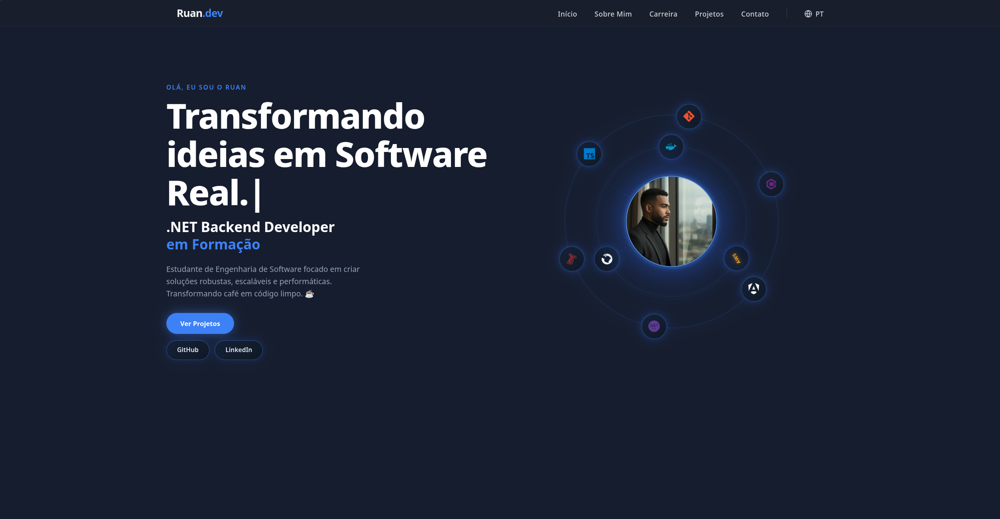

<h1 align="center">Portfolio — Ruan Alexandre</h1>

<p align="center">
  <a href="https://portfolio-ruan-alexandre-s.vercel.app/">
    
  </a>
  <a href="https://vercel.com">
    
  </a>
  
  
</p>

## 🖼️ Preview



> Live: **[portfolio-ruan-alexandre-s.vercel.app](https://portfolio-ruan-alexandre-s.vercel.app/)**

## 📖 About

A modern, performance-oriented developer portfolio built with **Angular 21** and **standalone components**.
Showcases career, education, certificates and projects with smooth animations, multi-language support and a fully responsive UI.

## 🛠️ Tech Stack

| Layer            | Technology                              |
| ---------------- | --------------------------------------- |
| Framework        | Angular 21                              |
| Language         | TypeScript 5.9                          |
| Styling          | TailwindCSS 3.4                         |
| Reactivity       | Angular Signals + RxJS 7.8              |
| Email            | EmailJS 4.4.1                           |
| Build / Deploy   | Angular CLI · Vercel                    |
| Testing          | Vitest                                  |

## ✨ Features

- 🌗 Dark / Light mode toggle with persistent theme
- 🌐 Multi-language support (🇧🇷 PT · 🇺🇸 EN · 🇪🇸 ES)
- ⌨️ Typewriter animation on hero section
- 🪐 Orbital tech-stack animation
- 📨 Contact form integrated with **EmailJS**
- 📱 Fully responsive (mobile-first)
- ⚡ Lazy-loaded sections via `@defer`
- ♿ Accessible color tokens & semantic markup

## 🏗️ Architecture

The project follows modern Angular 21 best practices:

- **Standalone components** — no `NgModule`, simpler tree-shaking
- **Signals** — fine-grained reactivity for state and theming
- **OnPush change detection** — minimized re-renders
- **`@defer` blocks** — viewport-aware lazy loading
- **Lazy routing** — feature chunks loaded on demand
- **Service-driven** — `IdiomaService`, `ThemeService` for global state

## 🌐 Internationalization (i18n)

A custom **`IdiomaService`** powered by Angular Signals delivers reactive language switching across the app:

- 🇧🇷 Portuguese (default)
- 🇺🇸 English
- 🇪🇸 Spanish

Translations live in typed dictionaries and update synchronously when the user toggles the language — no page reload required.

## 🚀 Performance

| Metric                 | Value                                  |
| ---------------------- | -------------------------------------- |
| Initial bundle         | **273 kB** (down from 396 kB · **-31%**) |
| Lazy chunks            | 6 (home, career, education, certificates, projects, framework) |
| Change detection       | OnPush everywhere                      |
| Rendering              | Signals + `@defer` viewport triggers   |

## 🏁 Getting Started

```bash
# Clone
git clone https://github.com/RuanAlexandre/portfolio.git
cd portfolio

# Install
npm install

# Run dev server → http://localhost:4200
npm start

# Production build
npm run build
```

## 📜 Scripts

| Script          | Description                            |
| --------------- | -------------------------------------- |
| `npm start`     | Run dev server on `localhost:4200`     |
| `npm run build` | Production build into `dist/`          |
| `npm run watch` | Dev build in watch mode                |
| `npm test`      | Run unit tests with Vitest             |

## ☁️ Deploy

Continuously deployed to **Vercel** — every push to `main` triggers a new production build.

🔗 **[portfolio-ruan-alexandre-s.vercel.app](https://portfolio-ruan-alexandre-s.vercel.app/)**

## 📄 License

Released under the **MIT License**.

---

<p align="center">Made with ❤️ and Angular by <a href="https://github.com/RuanAlexandre">Ruan Alexandre</a></p>
