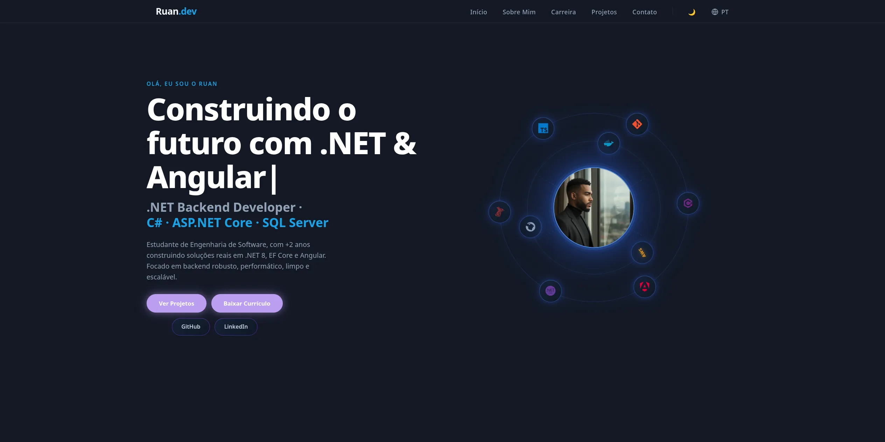

<h1 align="center">Portfolio — Ruan Alexandre</h1>

<p align="center">
  <a href="https://portfolio-ruan-alexandre-s.vercel.app/">
    
  </a>
  
  
  
</p>

## 🖼️ Preview



> Live: **[portfolio-ruan-alexandre-s.vercel.app](https://portfolio-ruan-alexandre-s.vercel.app/)**

## 📖 About

A performance-oriented developer portfolio built with **Angular 21** and standalone components.

The interesting part is not the feature list — it is the set of constraints the app is built
against: **runtime language switching without a reload**, **no RxJS in application code**, and an
**initial bundle that carries only the shell**. The [Technical Decisions](#-technical-decisions)
section explains what was traded away to get there.

## 🛠️ Tech Stack

| Layer          | Technology                        | Notes                                              |
| -------------- | --------------------------------- | -------------------------------------------------- |
| Framework      | Angular 21                        | Standalone components, no `NgModule`               |
| Language       | TypeScript 5.9                    | Strict typing across the i18n dictionaries         |
| Styling        | TailwindCSS 3.4                   | Semantic CSS custom properties for theming         |
| Reactivity     | Angular Signals                   | No RxJS imported in `src/app` — see decision #1    |
| Change detection | Zone.js 0.16                    | `OnPush` on 13 / 13 components                     |
| Email          | EmailJS 4.4.1                     | Contact form, no backend required                  |
| Build / Deploy | Angular CLI 21 · Vercel           | Push to `main` triggers production build           |
| Testing        | Vitest 4                          | `jsdom` environment                                |

## 📁 Project Structure

```
src/app/
├── components/           # Shell UI — lives outside the router outlet
│   ├── header/           # Fixed nav: routing, language + theme toggles
│   └── footer/           # Footer with fragment links back to home sections
├── i18n/                 # Typed translation dictionaries (pt · en · es)
│   └── types.ts          # Single source of truth: every locale must satisfy it
├── pages/
│   ├── home/             # Landing route
│   │   └── sections/     # hero · about · skills · career · education
│   │                     # certificates · projects · contact
│   └── projetos/         # Dedicated /projetos route, reuses ProjectsComponent
└── services/             # Signal-based global state (providedIn: 'root')
                          # idioma · tema · projeto
```

The shell (`header` / `footer`) sits in `app.component.html` **around** the `<router-outlet>`, so
language and theme state survive navigation instead of being re-instantiated per route.

## 🧭 Routes

| Route       | Component           | Loading                        |
| ----------- | ------------------- | ------------------------------ |
| `/`         | `HomeComponent`     | **Lazy** via `loadComponent()` |
| `/projetos` | `ProjetosComponent` | **Lazy** via `loadComponent()` |
| `**`        | → redirects to `/`  | —                              |

Both routes are lazy-loaded. That is deliberate: the initial bundle contains only the shell, the
router and the services, so the landing route is not privileged over the rest of the app.

`/projetos` reuses the exact same `ProjectsComponent` as the home page, driven by an input:
`[mostrarVerMais]="false"` hides the "see more" CTA that would otherwise link to itself.

## 🧠 Technical Decisions

### 1. Signals instead of `BehaviorSubject` for i18n state

- **Problem** — every component reads translated text. With a `BehaviorSubject`, each one needs an
  `async` pipe or a manual `subscribe`/`unsubscribe`, and `OnPush` only refreshes when the pipe
  marks the view dirty.
- **Choice** — `IdiomaService` exposes `signal<Idioma>('PT')` as a read-only signal plus a
  `computed<Textos>()` that derives the whole dictionary from it.
- **Why** — the derivation is glitch-free and recomputes only when the language actually changes.
  Templates read `t.menu.inicio` directly, with no subscription to leak and no `async` pipe. The
  practical outcome: **RxJS is not imported anywhere in `src/app`** — it stays a transitive Angular
  dependency instead of application surface area.

### 2. Hand-rolled i18n instead of `@angular/localize`

- **Problem** — the site needs PT / EN / ES with instant switching from a header button.
- **Choice** — typed dictionaries in `src/app/i18n`, keyed by locale and constrained by a shared
  `Textos` interface. `@angular/localize` is **not** installed.
- **Why** — `@angular/localize` compiles **one bundle per locale**, so switching language means
  navigating to a different build. That is the right call for content-heavy sites indexed per
  locale; for a single-page portfolio it means 3× the deploy artifacts to change one word in a
  header. The dictionary approach switches at runtime with zero reload from a single bundle.
- **Trade-off accepted** — no ICU message format, no extraction tooling, and translations are
  compiled into the bundle rather than fetched. The `Textos` interface is what keeps this honest:
  adding a key to `types.ts` breaks the build until all three locales define it.

### 3. `@defer (on viewport)` on below-the-fold sections

- **Problem** — the home route composes eight sections, but a visitor sees only the hero on load.
- **Choice** — four sections are wrapped in `@defer (on viewport)`: **projects**, **career**,
  **education** and **certificates**. Hero, about, skills and contact stay eager.
- **Why** — each deferred block becomes its own chunk, downloaded when the placeholder scrolls into
  view. In the production build these are `certificates` (7.68 kB), `education` (6.41 kB) and
  `career` (6.00 kB) — weight that never blocks first paint.
- **Gotcha worth knowing** — a deferred section is *absent from the DOM* until it triggers, so
  anchor links to it silently fail. The career placeholder therefore carries `id="career"` itself,
  so `/#career` has a scroll target even before the block renders.

### 4. `inject()` instead of constructor injection

- **Problem** — constructor parameter injection forces every dependency through the constructor
  signature, which becomes noise in components that only need a service to read one getter.
- **Choice** — `inject()` in field initializers. **13 of 13 components** use it; there are zero
  `constructor(private ...)` declarations in `src/app`.
- **Why** — dependencies resolve inline where they are used, subclasses do not have to thread
  arguments through `super()`, and injection works inside reusable functions rather than being
  tied to class construction.

### 5. WebP for every image asset

- **Problem** — the original PNG/JPG screenshots dominated the transfer size, dwarfing the JS
  bundle by an order of magnitude.
- **Choice** — every raster asset converted to WebP at quality 80, keeping the original files in
  the repository as masters.
- **Why** — images were the actual bottleneck, not JavaScript. Optimizing a 336 kB bundle while
  shipping 3.4 MB of PNG would have been pure theatre.

| Asset            | Original    | WebP        | Saved      |
| ---------------- | ----------- | ----------- | ---------- |
| `foto2`          | 1133.4 kB   | 20.8 kB     | **-98.2%** |
| `latam`          | 1229.0 kB   | 85.9 kB     | **-93.0%** |
| `kajita`         | 589.1 kB    | 43.4 kB     | **-92.6%** |
| `Portfolio`      | 399.9 kB    | 53.6 kB     | **-86.6%** |
| `minhafoto`      | 72.3 kB     | 16.0 kB     | **-77.9%** |
| `NotaFiscal`     | 72.4 kB     | 31.8 kB     | **-56.1%** |
| **Total**        | **3496.1 kB** | **251.5 kB** | **-92.8%** |

Project cards use `loading="lazy"`; only the profile photo is preloaded via
`<link rel="preload">`, since it is the one image above the fold.

## 🚀 Performance

Numbers below come from `npm run build` (production configuration):

| Metric                     | Value                                             |
| -------------------------- | ------------------------------------------------- |
| Initial bundle (raw)       | **336.86 kB**                                     |
| Initial bundle (transfer)  | **92.68 kB**                                      |
| Lazy chunks                | **8**                                             |
| Largest lazy chunk         | `home-component` — 81.72 kB raw · 17.68 kB transfer |
| Deferred section chunks    | certificates 7.68 kB · education 6.41 kB · career 6.00 kB |
| `OnPush` coverage          | 13 / 13 components                                |
| Image payload              | 3.4 MB → 251 kB (WebP)                            |

## ✨ Features

- 🌗 Dark / Light mode persisted to `localStorage`, applied via a root `.light` class
- 🌐 Runtime language switching (🇧🇷 PT · 🇺🇸 EN · 🇪🇸 ES) with no page reload
- ⌨️ Typewriter animation on the hero section
- 🪐 Orbital tech-stack animation
- 📨 Contact form wired to **EmailJS** — no backend to host
- 🎯 Curated project showcase: a `destaque` flag keeps the home grid to three cards while
  `/projetos` lists everything
- 📱 Mobile-first responsive layout with a sticky footer
- ♿ CTA gradients validated at **WCAG AA** (≥ 4.5:1) in both themes

## 🏁 Getting Started

```bash
# Clone
git clone https://github.com/ruanalexandreS/Portfolio.git
cd Portfolio

# Install
npm install

# Run dev server → http://localhost:4200
npm start

# Production build
npm run build
```

## 📜 Scripts

| Script          | Description                        |
| --------------- | ---------------------------------- |
| `npm start`     | Dev server on `localhost:4200`     |
| `npm run build` | Production build into `dist/`      |
| `npm run watch` | Development build in watch mode    |
| `npm test`      | Unit tests with Vitest             |

## ☁️ Deploy

Continuously deployed to **Vercel** — every push to `main` triggers a new production build.

🔗 **[portfolio-ruan-alexandre-s.vercel.app](https://portfolio-ruan-alexandre-s.vercel.app/)**

## 📄 License

Released under the **MIT License**.

---

<p align="center">Made with ❤️ and Angular by <a href="https://github.com/ruanalexandreS">Ruan Alexandre</a></p>
